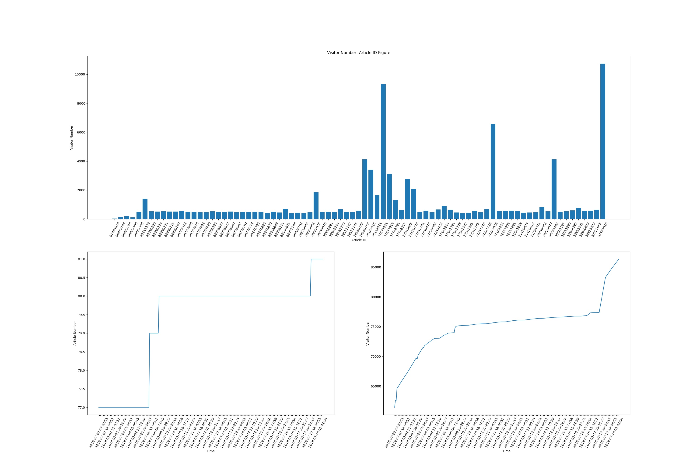
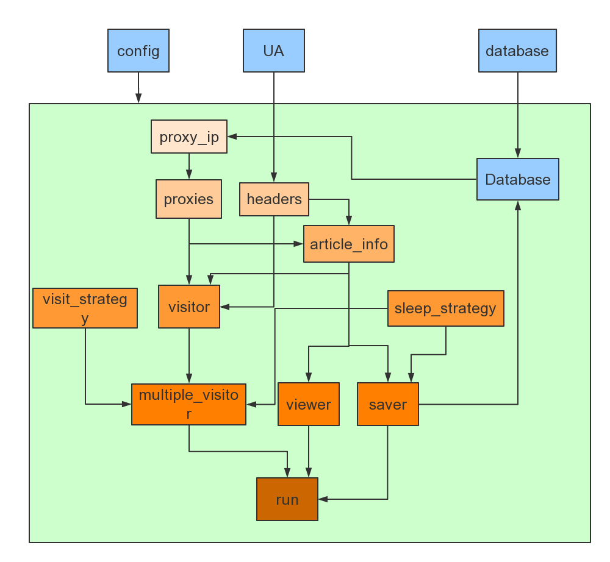

CSDN博客自动访问脚本

---

作者：yooongchun

Email：yooongchun@foxmail.com

微信公众号：yooongchun小屋


---

- 功能：该程序可实现自动访问CSDN博客某博主的所有文章。具体来说，包括以下几项：

  - 访问某博主的文章列表获取所有URL和统计访问量信息
  - 可视化博主文章的访问信息
  - 自动访问，增加访问量

- 开发环境：`Python3.6+requests+bs4+SQLite` ，其中`requests` ，模块用来请求网页，`bs4` 模块用来解析网页，`SQLite` 模块来进行数据存取

- 用法：

  - 可视化信息只需调用`viewer`函数：

    ```python
    visitor = CSDNBlogVisitor(bolgger)
    visitor.viewer(VIEW_WITH_IMG=True)
    ```

    运行的结果示例如下：

    ```python
    INFO:root:CSDNBlogVisitor:访问URL:http://blog.csdn.net/zyc121561/article/list/1
    INFO:root:CSDNBlogVisitor:访问URL:http://blog.csdn.net/zyc121561/article/list/2
    INFO:root:CSDNBlogVisitor:访问URL:http://blog.csdn.net/zyc121561/article/list/3
    INFO:root:CSDNBlogVisitor:访问URL:http://blog.csdn.net/zyc121561/article/list/4
    INFO:root:CSDNBlogVisitor:访问URL:http://blog.csdn.net/zyc121561/article/list/5
    INFO:root:CSDNBlogVisitor:统计时间：2018-07-02 15:45:26.265334  统计文章数：77  总计访问量：61678
    INFO:root:CSDNBlogVisitor:绘制访问信息统计图...
    ```

    

  - 自动访问只需启动`run` 函数：

    ```python
    visitor = CSDNBlogVisitor(bolgger)
    visitor.run()
    ```

    访问过程打印信息示意如下：

    ```python
    INFO:root:CSDNBlogVisitor:开始第1轮访问！
    INFO:root:CSDNBlogVisitor-save:保存统计信息...
    INFO:root:CSDNBlogVisitor:访问URL:http://blog.csdn.net/zyc121561/article/list/1
    ...
    INFO:root:database-INFO_Pool:写入数据库表：info_table...
    INFO:root:CSDNBlogVisitor-save:休眠中...
    ...
    INFO:root:CSDNBlogVisitor:当前统计文章数：77    文章总访问次数：62051
    INFO:root:CSDNBlogVisitor:进度：1/77    1.30%
    ...
    INFO:root:CSDNBlogVisitor:访问URL:https://blog.csdn.net/zyc121561/article/details/52722665
    INFO:root:CSDNBlogVisitor:访问URL成功，IP:121.232.148.136:9000
    INFO:root:CSDNBlogVisitor:进度：77/77   100.00%
    ...
    INFO:root:CSDNBlogVisitor:完成第1轮访问，耗时：224.00秒
    当前统计文章数：77      文章总访问次数：62180   本轮有效访问次数：129
    INFO:root:CSDNBlogVisitor:随机休眠剩余时间：22.48 秒
    ...
    ```

- 程序主模块框架示意图：`BlogVisitor` 类内的函数调用关系及其与其余模块交互示意如下

  

- 程序主要框架：包含了5个模块。各个模块说明如下：

  - `UA.py` 模块：负责提供请求头，请求头主要为了模拟不同浏览器额行为，减少防爬虫机制影响，该模块调用方法：

    ```python
    from UA import FakeUserAgent
    headers=FakeUserAgent().random_headers()
    ```

    返回的是一个随机请求头

  - `database.py` 模块：该模块用来提供数据的存取功能，使用数据库`SQLite` 完成，主要包括了两个类一个是`IP_Pool` 类，用来存取IP地址，另一个是`INFO_Pool`，用来存取博客信息。

  - `ProxyIP.py` 模块：该模块用来获取代理IP，关于这个模块的详细信息可参考这里：https://github.com/yooongchun/ProxyIP

    基本用法：

    启动main函数即可启用抓取进程和验证进程（双进程模式）。

    ```
    main()
    ```

    如果只想启用抓取IP的进程，则运行:

    ```
    crawl=Crawl()
    crawl.run()
    ```

    如果只想启用验证进程，则运行：

    ```
    validation=Validation()
    validation.run()
    ```

  - `config.py` 模块：该模块用来配置输出信息的相关信息，比如：日志打印到控制台还是文件，以及打印级别等，只需要在该模块中设定1参数后在别的模块中这样引用：

    ```python
    import config
    config.config()
    ```

  - `BlogVisitor.py` 模块，这是程序的核心模块，主要实现博客的信息统计和自动访问功能

- 程序开发思路：

  - 实现访问次数增加：其实本质上就是爬虫程序，通过访问特定url来请求网页，最简单的请求方法为：

    ```python
    response=requests.get(url)
    ```

    换句话说，整个程序就是以这一句代码为核心进行拓展的。

  - 网站对请求会进行判断，如果单个IP短时间内大量访问，则很可能是爬虫程序，这时网站可能会封禁该IP，为了应对这种情况，需要使用代理IP进行访问：

    ```python
    requests=(url=url,proxies=proxies,headers=headers,timeout=time)
    ```

    这里，代理IP就是`proxies`，其构造方式为：

    ```python
    proxies={"http":"http://"+IP+":"+PORT}
    ```

    而代理IP的获取可参考这里：https://github.com/yooongchun/ProxyIP

  - 获得信息之后需要进行一些额外操作，即：保存数据和数据可视化，保存数据使用`SQLite`模块构建了一个`IP_Pool` 类来保存代理IP信息，用`INFO_Pool` 来保存博客信息。

- 最后的一点说明：写这篇文章仅是为了学习Python爬虫，用实际项目来练手，而刷访客量这样的行为本身实不可取，也非我写博客的初衷，因而各位在借鉴时切勿舍本逐末，混淆了重点！

- Have Fun！